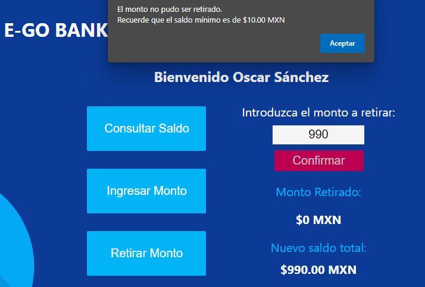

# PROYECTO JS BÁSICO CAJERO **AUTOMÁTICO**

[Ver este proyecto](https://sato31.github.io/coding-cajeroATM/)

Al ingresar al cajero, puedes seleccionar la cuenta con la que deseas interactuar. Deben existir al menos tres cuentas.


Para esto, puedes trabajar con un arreglo de objetos como el siguiente:

```
var user =[  
	{ nombre:"Edrei Hernández", saldo:100.00, password:"edrei"},  
	{ nombre:"Goretty Flores", saldo:150.00, password:"gore"},  
	{ nombre:"Oscar Sánchez", saldo:50.00, password:"sanchez"}
]
```

Al seleccionar una cuenta, debes ingresar el password asociado a la cuenta.


Si el password es incorrecto, debes notificar al usuario y permitirle intentarlo nuevamente.


Si el password es correcto, debes mostrar las siguientes opciones:

* **Consultar saldo**
* **Ingresar monto**
* **Retirar monto**


Al seleccionar consultar saldo, debe mostrar en pantalla el saldo actual de la cuenta.


Al seleccionar ingresar monto, el usuario debe escribir el monto a ingresar.


Al ingresar el monto, debe mostrarle al usuario el monto ingresado y el nuevo saldo total.


Al seleccionar retirar monto, el usuario debe escribir el monto a retirar.


Al retirar el monto, debe mostrarle al usuario el monto retirado y el nuevo saldo total.


Como regla de negocio, una cuenta no debe de tener más de $990 y menos de $10.




Es necesario hacer las validaciones pertinentes en tu código para que no se rompa esta regla de negocio.
